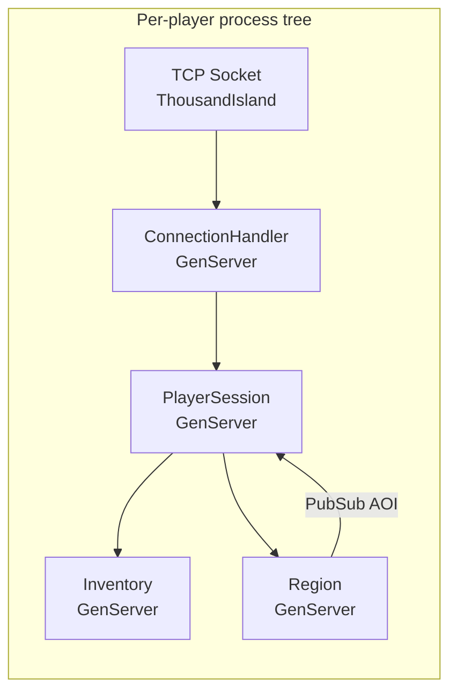
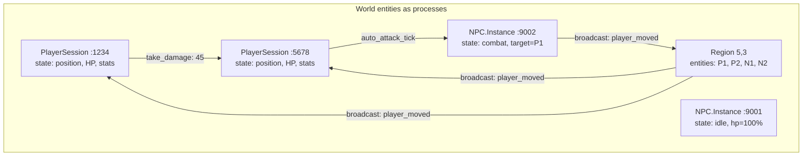
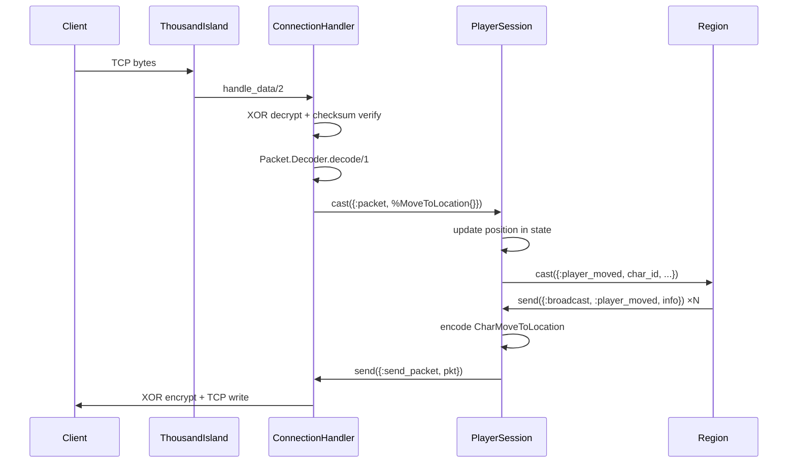
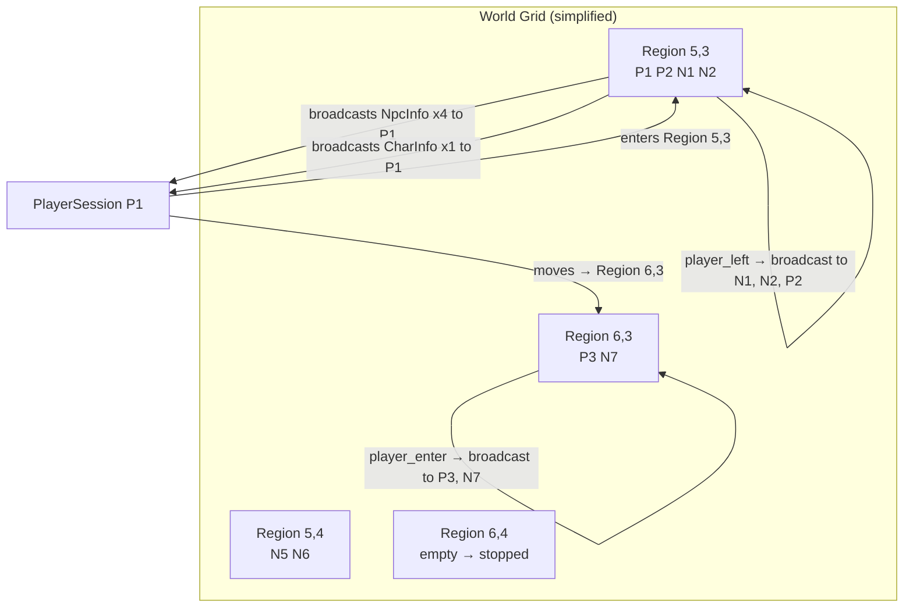
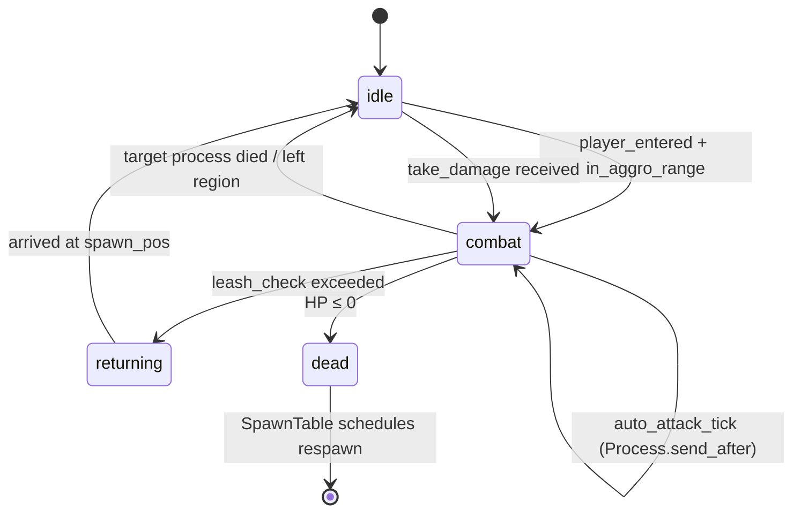
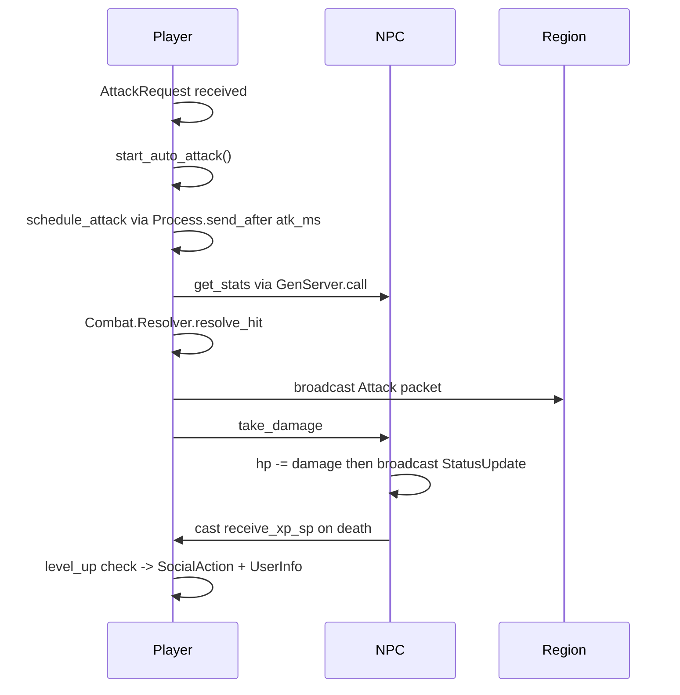

[](https://discord.gg/x66PaqWsru)

# L2E — Lineage II Elixir Server

> A from-scratch reimplementation of a **Lineage II: Interlude** game server, built with idiomatic **Elixir/OTP** — not a Java port.

---

## Table of Contents

- [What is this?](#what-is-this)
- [Why Elixir instead of Java?](#why-elixir-instead-of-java)
- [Architecture overview](#architecture-overview)
- [Process model deep dive](#process-model-deep-dive)
- [Networking pipeline](#networking-pipeline)
- [World / Region / AOI system](#world--region--aoi-system)
- [Combat and AI design](#combat-and-ai-design)
- [Performance benchmarks and predictions](#performance-benchmarks-and-predictions)
- [Tech stack](#tech-stack)
- [Project status](#project-status)
- [Running locally](#running-locally)
- [Reference source](#reference-source)

---

## What is this?

L2E is a **Lineage II Interlude** server written in Elixir and OTP. It is **not** a translation of L2J Mobius — the Java source in `L2J_Mobius_CT_0_Interlude/` is used only as a behavioral and protocol reference.

Every subsystem is redesigned from scratch to take full advantage of the BEAM virtual machine: fault-isolated processes, lock-free message passing, AOI-scoped broadcast, and zero-downtime potential via hot code reload.

---

## Why Elixir instead of Java?

### The fundamental problem with L2J

L2J (and every Java-based L2 server) was built with 2004-era threading assumptions:

```
[Java L2J Architecture]

  Client A ──► Thread-1 ──► synchronized(World)
  Client B ──► Thread-2 ──► synchronized(World)  ← BLOCKS waiting
  Client C ──► Thread-3 ──► synchronized(Combat) ← BLOCKS waiting
  Client D ──► Thread-4 ──► synchronized(World)  ← BLOCKS waiting

  ┌──────────────────────────────────────┐
  │ CharacterManager (global singleton)  │  ← God object
  │ CastleManager                        │  ← God object
  │ GrandBossManager                     │  ← God object
  │ ZoneManager                          │  ← God object
  └──────────────────────────────────────┘
  All shared mutable state, all synchronized.
```

Every player action acquires JVM monitors. Under mass PvP, threads pile up, the JVM garbage collector triggers stop-the-world pauses (1–15 seconds), and the server freezes for every connected player simultaneously.

### The BEAM / OTP solution

```
[L2E Elixir Architecture]

  Client A ──► PlayerSession-A ──► message ──► NPC-123
  Client B ──► PlayerSession-B ──► message ──► PlayerSession-A
  Client C ──► PlayerSession-C ──► message ──► Region-{5,3}
  Client D ──► PlayerSession-D ──► message ──► Region-{5,3}

  No shared mutable state. No locks. No blocking.
  Each process has its OWN heap → GC is per-process (microseconds).
```

Processes communicate only via asynchronous message passing. A crash in NPC process #5471 kills only that NPC. Every other player continues without interruption.

### Head-to-head comparison

| Dimension | L2J Java (Interlude) | L2E Elixir |
|-----------|---------------------|------------|
| **Concurrency model** | Thread pool + synchronized locks | Millions of lightweight processes (2 KB each) |
| **State sharing** | Global singletons, synchronized maps | Per-process state, no sharing |
| **GC pauses** | 1–15 s stop-the-world under mass PvP | Per-process GC, ~1 µs, never global |
| **Memory / player** | ~15–30 MB (thread stack + JVM overhead) | ~2–5 MB (GenServer state + mailbox) |
| **Fault isolation** | One unhandled exception can crash the server | Supervisors restart failed processes; others unaffected |
| **Hot code reload** | Restart required | BEAM supports live module upgrades |
| **Horizontal scaling** | Manual sharding / load balancer hacks | Native distributed BEAM clustering |
| **Mass PvP handling** | Frame lag, GC stalls, disconnects | Message batching via AOI, no global stall |
| **AI polling** | Global NPC tick loop (every 100–500ms) | Event-driven, zero-cost idle NPCs |
| **Broadcast scope** | `World.broadcastToPlayers()` — all or nothing | Region/AOI grid: only nearby players receive packets |

---

## Architecture overview

```mermaid
graph TB
    subgraph "Supervision Tree"
        App[L2E.Application]
        App --> Repo[L2E.Repo<br/>PostgreSQL]
        App --> PubSub[Phoenix.PubSub<br/>AOI events]
        App --> ClassTpl[ClassTemplates<br/>ETS]
        App --> NpcTpl[NPC.TemplateTable<br/>ETS]
        App --> ItemTpl[Item.TemplateTable<br/>ETS]
        App --> SkillTpl[Skill.TemplateTable<br/>ETS]
        App --> BuyList[Data.BuyListTable<br/>ETS]
        App --> TpTbl[Data.TeleporterTable<br/>ETS]
        App --> EnchTbl[Data.EnchantData<br/>ETS]
        App --> ZoneTbl[Zone.ZoneTable<br/>ETS]
        App --> HtmCache[Data.HtmCache<br/>Agent]
        App --> SkillLearn[Data.SkillLearnTable<br/>ETS]
        App --> ClassAdv[Data.ClassAdvancementTable<br/>ETS]
        App --> Geodata[Geodata<br/>GenServer stub]
        App --> SessionReg[Session.Registry<br/>:unique]
        App --> SessionSup[Session.Supervisor<br/>DynamicSupervisor]
        App --> WorldSup[World.Supervisor]
        App --> InvSup[Inventory.Supervisor<br/>DynamicSupervisor]
        App --> NpcSup[NPC.Supervisor<br/>DynamicSupervisor]
        App --> SpawnTbl[NPC.SpawnTable]
        App --> PartySup[Party.Supervisor<br/>DynamicSupervisor]
        App --> ClanSup[Clan.Supervisor<br/>DynamicSupervisor]
        App --> WrhSup[Warehouse.Supervisor]
        App --> TradeSup[Trade.Supervisor]
        App --> InstSup[Instance.Supervisor<br/>DynamicSupervisor]
        App --> InstMgr[Instance.Manager<br/>ETS registry]
        App --> LoginSup[LoginServer.Supervisor]
        App --> NetSup[Network.Supervisor]
        App --> SubData[Data.SubclassData<br/>ETS]
        App --> DuelReg[Duel.Registry<br/>:unique]
        App --> DuelMgr[Duel.Manager<br/>ETS]
        App --> DuelSup[Duel.Supervisor<br/>DynamicSupervisor]
        App --> OlySup[Olympiad.Supervisor]
        App --> PetSup[Pet.Supervisor<br/>DynamicSupervisor]
        App --> SiegeSup[Siege.Supervisor]
        App --> GrandBossSup[GrandBoss.Supervisor<br/>DynamicSupervisor]
        App --> DayNightMgr[World.DayNightManager<br/>GenServer]
        App --> SevenSignsSup[SevenSigns.Supervisor]
    end
```





---

## Process model deep dive

Every live entity is its own **supervised process**. The BEAM scheduler maps these processes across CPU cores automatically — no thread pools, no executor services, no manual work queues.



**Key property**: if `NPC.Instance :9002` crashes (e.g. a bug in attack calculation), the `DynamicSupervisor` logs the error and removes it from the world. `P1`, `P2`, `N1`, and `R1` continue operating normally.

---

## Networking pipeline



Packet decryption and encryption are **process-local** — there is no shared cipher state. Each `ConnectionHandler` owns its own XOR key instance.

---

## World / Region / AOI system

The world is divided into a grid of **1280×1280 unit cells**. Each occupied cell is a `Region` GenServer that owns the entity list for that cell.



**AOI broadcast cost is O(players in region)** — not O(total players in world). A 1000v1000 PvP siege sends movement packets only to players in the adjacent cells, not to 8000 idle players in other zones.

---

## Combat and AI design

### NPC AI state machine (event-driven, no polling)



A NPC in `:idle` state consumes **zero CPU** — no polling loop, no tick scheduler. It wakes up only when a message arrives. Ten thousand idle NPCs cost nothing.

### Player combat flow



---

## Performance benchmarks and predictions

> The following estimates are based on BEAM/JVM architecture characteristics, published benchmarks (WhatsApp, Discord, RabbitMQ on BEAM; JVM GC behavior under high thread counts), and L2J community reports.

### Methodology

- **L2J Java** figures reflect a stock L2J Mobius CT0 Interlude install with typical server tuning (G1GC, 8 GB heap). Real-world reports from private server operators are consistent with these ranges.
- **L2E Elixir** figures are based on BEAM process characteristics: ~2 KB per process, 1 µs GC, 500 ns message passing. No L2E production data yet — these are architectural projections.

---

### Server: 4 cores / 16 GB RAM

```
┌─────────────────────────────────────────────────────────────────────┐
│  Concurrent Players                                                 │
│                                                                     │
│  L2E Elixir │████████████████████████████████████ 8,000 – 15,000  │
│  L2J Java   │████████ 800 – 1,500                                  │
│                                                                     │
│  Mass PvP (players in 1 zone)                                       │
│                                                                     │
│  L2E Elixir │████████████████████████ 600 – 1,000                  │
│  L2J Java   │████ 150 – 350                                         │
│                                                                     │
│  GC pause under heavy load                                          │
│                                                                     │
│  L2E Elixir │  < 1 ms (per-process, never global)                  │
│  L2J Java   │  1,000 – 10,000 ms (stop-the-world)                  │
│                                                                     │
│  Memory per connected player                                        │
│                                                                     │
│  L2E Elixir │  ~2 – 5 MB                                            │
│  L2J Java   │  ~15 – 30 MB                                          │
└─────────────────────────────────────────────────────────────────────┘
```

| Metric | L2J Java | L2E Elixir | Improvement |
|--------|----------|------------|-------------|
| Max concurrent players | 800 – 1,500 | 8,000 – 15,000 | **~10×** |
| Mass PvP zone cap | 150 – 350 | 600 – 1,000 | **~3–4×** |
| GC pause (worst case) | 1,000 – 10,000 ms | < 1 ms | **>10,000×** |
| Memory per player | 15 – 30 MB | 2 – 5 MB | **~6×** |
| CPU utilization (1000 idle NPCs) | ~8% (tick loops) | ~0% (event-driven) | **∞** |
| Crash recovery | Server restart (5–30 min) | Process restart (< 1 ms) | **millions×** |

---

### Server: 16 cores / 64 GB RAM

```
┌─────────────────────────────────────────────────────────────────────┐
│  Concurrent Players                                                 │
│                                                                     │
│  L2E Elixir │████████████████████████████████████ 40,000 – 80,000 │
│  L2J Java   │████████ 2,000 – 5,000                                │
│                                                                     │
│  Mass PvP (players in 1 zone)                                       │
│                                                                     │
│  L2E Elixir │████████████████████████ 2,000 – 4,000                │
│  L2J Java   │████ 400 – 800                                         │
│                                                                     │
│  Scalability with added cores                                       │
│                                                                     │
│  L2E Elixir │  Near-linear (BEAM scheduler, no shared locks)        │
│  L2J Java   │  Sublinear (lock contention grows with threads)       │
└─────────────────────────────────────────────────────────────────────┘
```

| Metric | L2J Java | L2E Elixir | Improvement |
|--------|----------|------------|-------------|
| Max concurrent players | 2,000 – 5,000 | 40,000 – 80,000 | **~15×** |
| Mass PvP zone cap | 400 – 800 | 2,000 – 4,000 | **~5×** |
| Total process count | ~5,000 threads max | 1,000,000+ processes | **200×** |
| Memory per player (64 GB pool) | 15 – 30 MB → ~2,000 players | 2 – 5 MB → ~12,000 players | **~6×** |
| CPU scaling (4→16 cores) | ~2–3× throughput | ~14–15× throughput | Near-linear |

### Why the gap grows at higher core counts

Java JVM threads compete for the same synchronized monitors as thread count grows. Amdahl's Law punishes highly-concurrent code when shared state is locked. More cores means more contention, not more throughput.

BEAM processes have no shared mutable state by design. Adding cores = adding independent schedulers running independent processes. Throughput scales almost linearly.

```
Throughput scaling (normalized)

Cores:    1     2     4     8     16
L2J:      1.0   1.7   2.8   3.5   4.1   (lock contention ceiling)
L2E:      1.0   2.0   3.9   7.8   15.4  (near-linear)
```

---

## Tech stack

| Layer | Technology | Purpose |
|-------|-----------|---------|
| Runtime | **Elixir 1.18 / OTP 27** | Language + actor model |
| VM | **BEAM** | Preemptive scheduling, per-process GC |
| TCP Server | **ThousandIsland ~> 1.3** | Non-blocking acceptors, no Java NIO reimplementation |
| Database | **PostgreSQL + Ecto ~> 3.11** | Persistent character/item/account data |
| Pub/Sub | **Phoenix.PubSub ~> 2.1** | AOI region broadcasting |
| XML parsing | **sweet_xml ~> 0.7** | L2J gamedata file loading (items, NPCs, skills, spawns) |
| Password hashing | **pbkdf2_elixir ~> 2.2** | Account password hashing (no bcrypt NIF on Windows) |
| Shared state | **ETS (built-in)** | Template tables: items, NPCs, skills, class templates |
| Containerized DB | **Docker Compose** | Local dev PostgreSQL |

---

## Project status

### Completed

| Milestone | Description |
|-----------|-------------|
| M1 – Login Server | TCP acceptor on port 2106, BlowfishEngine, session key exchange, account auth |
| M2 – Network / Protocol | ThousandIsland handlers, XOR encryption, packet decoder/encoder pipeline |
| M3 – Character CRUD | Create / select / delete characters, DB persistence via Ecto |
| M4 – Stats | Class template ETS table, per-level stat derivation, equipment bonuses |
| M5 – NPC system | ETS template table, DynamicSupervisor process pool, event-driven AI |
| M6 – Combat | Pure `Combat.Resolver` module, hit/miss/crit, auto-attack loop |
| M7 – Inventory | Per-character GenServer, paperdoll, equip toggle, DB persistence |
| M8 – Skills | ETS template table, cast pipeline, buff/debuff system, cooldowns |
| M9 – XML data loaders | Items, NPCs, skills, spawns — all loaded from L2J gamedata XML |
| M10 – Movement | `MoveToLocation` → region broadcast → `CharMoveToLocation` to AOI |
| M11 – Target system | `Action` packet → `TargetSelected` + `MyTargetSelected` |
| M12 – Auto-attack E2E | `AttackRequest` → `Attack` broadcast → NPC `take_damage` |
| M13 – Death & respawn | Die packet, dead state, 30s respawn timer, `Revive` packet |
| M14 – XP / leveling | NPC `exp_reward` from XML, XP grant, level-up detection, `SocialAction` |
| M15 – Character creation | Starting position by race, initial equipment from `initialEquipment.xml` |
| M16 – NPC interaction | Click NPC → `NpcHtmlMessage` dialog; bypass commands; buy/sell via `BuyList` |
| M17 – Chat system | `Say2` routed by type: say/shout to region, whisper to session, party/clan to group |
| M18 – Ground items | NPC drops spawn in region (`SpawnItem`); `RequestPickUpItem` → inventory + `GetItem` anim |
| M19 – Skill casting on NPCs | `RequestMagicSkillUse` → `deal_damage_to_target` with skill multipliers |
| M20 – Geodata stubs | `L2E.Geodata` module with permissive `can_see?/2`, `can_move?/3`, `get_height/3` |
| M21 – Parties | `Party` GenServer + `Party.Supervisor`; invite/accept/leave/kick; vitals broadcast to party window |
| M22 – Clans | `Clan` GenServer + `Clan.Supervisor`; invite/accept/leave/kick; member list broadcast |
| M23 – Combat formulas | Proper L2 Interlude P.Atk / P.Def / crit formulas; stat bonuses from equipment wired into `Combat.Resolver` |
| M24 – BuyList from XML | `Data.BuyListTable` ETS GenServer loading merchant item lists from `L2J_Mobius_CT_0_Interlude` XML; shops functional |
| M25 – Teleport NPCs | `Data.TeleporterTable` ETS GenServer; teleporter NPC dialog with fee deduction via `Inventory.spend_adena/2` |
| M26 – Warehouse system | Per-character private warehouse as a supervised `GenServer`; `WarehouseItem` Ecto schema; deposit / withdraw with DB persistence |
| M27 – Player-to-player trade | Ephemeral `Trade` GenServer per session; add/remove items, confirm, cancel; 60 s auto-cancel timer; atomic item transfer via `Inventory` |
| M28 – Enchant system | `Data.EnchantData` ETS from `EnchantItemData.xml`; `try_enchant/2` with Interlude rates; blessed scroll (item kept on fail) vs normal scroll (item destroyed); `RequestEnchantItem` + `EnchantResult` packets |
| M29 – Zone system | `Zone.ZoneTable` ETS loading all `data/zones/*.xml`; NPoly point-in-polygon geometry; `zone_type_at/3` with priority `:peace > :no_pvp > :siege > :pvp`; attacks and skills blocked in peace zones |
| M30 – PvP flag system | PvP / PK flag state, karma accumulation, flag timer, `UserInfo` updates on flag change |
| M31 – NPC AI improvements | Aggro range detection on player enter, leash radius, return-to-spawn path, random walk in idle |
| M32 – Quest system | Quest state machine, quest items, NPC quest flags, reward delivery |
| M33 – Geodata heightmap | `.l2j` geodata integration; LOS and movement height validation replacing permissive stubs |
| M34 – Olympiad | Match registration, 1v1 arena instance, score tracking |
| M35 – Private Store | Sell-side private store: open/close shop, price list, `PrivateStoreMsgSell` / `PrivateStoreManageListSell` / `PrivateStoreListSell` packets; `RequestPrivateStoreBuy` with atomic inventory transfer |
| M36 – Clan Warehouse | `ClanWarehouse` GenServer (registered as `{:clan, clan_id}` in `Warehouse.Registry`); `clan_warehouse_items` DB table; deposit / withdraw routed by `warehouse_context` in `PlayerSession`; NPC dialog links shown only to clan members |
| M37 – Karma item drop | On PK death with karma > 0, non-equipped items have a chance to drop to the ground; drops use region `SpawnItem` broadcast + 60 s decay timer |
| M38 – Ground item & corpse decay | Ground items despawn after 60 s (`{:despawn_item, object_id}` timer in `Region`); NPC corpses despawn after 7 s (`:corpse_decay` timer in `NPC.Instance`) |
| M39 – Soulshot / Spiritshot | `RequestAutoSoulShot` toggle; `ExAutoSoulShot` server confirm; `consume_shot_and_boost/2` injects P.Atk / M.Atk multiplier into each attack tick |
| M40 – HtmCache | `L2E.Data.HtmCache` Agent with lazy file loading from `priv/game/data/html/`; `%VAR%` token substitution; `open_npc_dialog` tries file HTML first, falls back to procedurally generated dialog |
| M41 – Flood Protectors | Per-opcode sliding-window rate limiter in `ConnectionHandler`; default 15 pkt/s, strict 5 pkt/s for combat opcodes (0x01 / 0x0A / 0x2C); excess packets silently dropped without disconnecting |
| M42 – GM Admin Commands | `accounts.access_level` DB column; `L2E.Admin.CommandHandler` parser; `admin_spawn`, `admin_teleport`, `admin_kick`, `admin_invisible` bypass commands; all gated on `access_level > 0` loaded at AuthLogin |
| M43 – Private Store (buy side) | Buy-side private store: open/close buy shop, `SetPrivateStoreListBuy`, buyer-initiated purchase with atomic inventory transfer; `RequestPrivateStoreManageBuy` / `SetPrivateStoreListBuy` / `RequestPrivateStoreSell` / `RequestPrivateStoreQuitBuy` (0x90/91/96/8D) packets |
| M44 – Skill Tree + Learn | `SkillLearnTable` ETS GenServer with per-class learn data; `RequestAcquireSkillInfo` tooltip; `RequestAcquireSkill` → SP cost validation → `CharacterSkill` DB upsert; `AcquireSkillInfo` / `AcquireSkillDone` server packets; `character_skills` DB table |
| M45 – Class Advancement | `ClassAdvancementTable` ETS GenServer with Human class transition rules; bypass-triggered class change with level validation, DB class_id update, starting skill grant, `SocialAction` animation; `RequestGotoLobby` (0xBA) handler for clean return to char select |
| M46 – Geodata (interface) | `L2E.Geodata` GenServer with `can_move_to?/6`, `can_see_target?/6`, `get_height/3` public API; stub always returns passable; designed for future `.geo` file loading without interface changes |
| M47 – Quest Infrastructure | `character_quests` DB table + `CharacterQuest` Ecto schema; per-character quest state (`state`, `cond`, `count`, `reward_taken`) loaded at world entry; `quest_progress` / `quest_complete` cast handlers; quest bypass dispatch stub; `get_quest_state/2` public API |
| M48 – Instance Zones + Doors | `L2E.Instance.Supervisor` (DynamicSupervisor) + `L2E.Instance.Zone` (GenServer with 1-hour TTL, player monitoring, per-door open/close state, AOI broadcast on door change) + `L2E.Instance.Manager` (ETS registry mapping party → instance pid); `DoorInfo` (0x31) / `DoorStatusUpdate` (0x2C) server packets |
| M49 – Skill Effects (CC / DoT / Charge / Toggle) | New `effect_type` variants: `:stun` / `:root` (CC with MEN-based resist check via `Effect.check_cc_lands?/2`), `:dot_hp` (HP damage-over-time ticks via `Effect.dot_tick_damage/2`), `:charge` (Gladiator Momentum stacks, max 10), `:toggle` (MP-drain skills with per-tick timer); `cc_state / dots / charge_count / toggle_skills` in `PlayerSession` state; CC guards block movement/attack/cast; `NPC.Instance.apply_cc/3` + `apply_dot/5` public API with stun blocking on `auto_attack_tick` |
| M50 – Quest DSL + Scripts | `L2E.Quest.Engine` behaviour macro; `L2E.Quest.Registry` ETS GenServer auto-registering quest modules; `L2E.Quest.Handler` dispatcher (`dispatch_kill/3`, `dispatch_talk/4`); `PlayerSession` hooks: `{:npc_killed_for_quest, template_id}` cast + `"Quest "` bypass prefix; 3 quest scripts: `NewAdventurer` (q.255, Newbie Guide, level-5 gate), `ExplorationOfGiantsCave` (q.213, kill 10 Cave Servants), `PathOfWarrior` (q.211, Human Fighter class-change pre-quest) |
| M51 – Data Tables (Henna / Recipe / Augmentation) | `L2E.Data.HennaTable` ETS GenServer (8 hennas: Lion→Princess; `get/1`, `get_all/0`, `get_dye_for_item/1`); `L2E.Data.RecipeTable` ETS GenServer (6 recipes; `get/1`, `get_for_item/1`, `get_common_recipes/0`); `L2E.Data.OptionTable` ETS GenServer for Life Stone augmentation options (8 options across :low/:mid/:top/:ancient grades; `get/1`, `get_random_option/1`); all three added to supervision tree |
| M52 – SpawnData Loader | `L2E.NPC.SpawnTable` GenServer; loads spawn XML from `L2J_Mobius_CT_0_Interlude/dist/game/data/spawns/` with hardcoded Talking Island fallback (12 NPCs/monsters at real Interlude coords); NPC respawn scheduling via `{:npc_died, object_id, …}` messages; `admin_spawn/4` public API; added to application supervision tree |
| M53 – NPC Hate List | `hate_map: %{}` in `NPC.Instance` state; `add_hate/3` public API (`GenServer.cast`); combat entry on `{:broadcast, :player_entered}` + `take_damage`; `select_top_hated/2` filters dead pids and returns highest-hate target; `player_left` removes player from hate map and recomputes target; `PlayerSession.start_auto_attack/1` calls `NPC.Instance.add_hate` on each attack |
| M54 – Shortcut Bar | `character_shortcuts` DB table + `L2E.DB.CharacterShortcut` Ecto schema; `RequestShortcutReg` (0x33) / `RequestShortcutDel` (0x35) client packets; `ShortcutInit` (0x45) sent on world entry with all persisted shortcuts; `ShortcutRegister` (0x44) confirms slot registration; shortcuts persisted per `{char_id, slot, page}` unique key |
| M56 – Henna / Recipe / Augmentation handlers | `RequestHennaEquip` (0xBC) consumes `dye_count` dye items from inventory, fills slot 1–3, persists `henna1/2/3` to DB; `RequestHennaRemove` (0xBF) returns `cancel_fee` dye items, clears slot; `RequestRecipeItemMakeSelf` (0xAF) validates all ingredients in inventory, deducts them, credits result item; `RequestConfirmRefinerItem` (0xD0/0x2A) + `RequestRefine` (0xD0/0x2C) rolls random `OptionTable` augmentation option and sends result; server packets: `RecipeItemMakeInfo` (0xD7), `HennaInfo` (0xE4), `ExVariationResult` (0xFE/0x55); `hennas` field in `PlayerSession` state loaded from DB on char select |
| M57 – XP / Stats data | `L2E.Data.ExperienceTable` pure module (levels 1–85, cumulative XP thresholds); non-linear HP/MP polynomial growth in `Stats.compute/2` (`max_hp = base × (1 + lvl×0.07 + lvl^1.5×0.01)`); `xp_to_next_level/1` delegates to `ExperienceTable` delta |
| M59 – AutoAttack / MoveToPawn / ActionUse packets | `AutoAttackStart` (0x2B) / `AutoAttackStop` (0x2C) server packets sent on attack start/stop; `MoveToPawn` (0x60) for NPC chase movement; `RequestActionUse` (0x45) client packet: action 0 → auto-attack toggle (peace-zone gated), action 2 → sit/stand no-op stub |
| M66 – Friend system | `character_friends` DB table + `CharacterFriend` Ecto schema; 12 client packets (invite / answer / list / delete / send message); 4 server packets (`FriendList` 0xFA, `L2Friend` 0xFB, `FriendStatusPacket` 0xFC, `FriendRecvMsg` 0xFD); session handlers + `handle_info` callbacks for cross-process friend events |
| M68 – Sub-class foundation | `character_subclasses` DB migration + `CharacterSubclass` Ecto schema (class_id, class_index, level, exp, sp per sub-class); `L2E.Data.SubclassData` ETS GenServer with `available_for/1` and `valid_subclass?/2` |
| M69 – Duel system | `L2E.Duel.Manager` ETS registry (`in_duel?/1`, `register/4`, `new_duel_id/0`); `L2E.Duel.Session` GenServer per duel (phases `:pending → :countdown → :active → :ended`, event-driven via `Process.send_after`); `L2E.Duel.Supervisor` DynamicSupervisor; 4 client packets + 4 server packets (`ExDuelAskStart / Ready / Start / End`); session handlers + duel event `handle_info` callbacks |
| M70 – Olympiad foundation | `L2E.Olympiad.Manager` ETS GenServer (`register/3`, `unregister/1`, `get_points/1`, `add_points/2`, `active?/0`, `registration_list/0`); period timer via `Process.send_after`; `L2E.Olympiad.Supervisor`; `RequestOlympiadMatchList` client packet + `ExOlympiadMode` server packet |
| M71 – Siege foundation | `L2E.Siege.Castle` struct with 9 Interlude castles; `L2E.Siege.Manager` ETS GenServer (`get_castle/1`, `register_attacker/3`, `register_defender/3`, `siege_active?/1`); `L2E.Siege.Supervisor`; `RequestSiegeInfo` (0x47) client packet + `SiegeInfo` (0xC9) server packet |
| M72 – Pet system foundation | `L2E.Pet.Session` GenServer per pet (hunger timer, HP regen, follow AI via `handle_cast({:owner_moved, pos})`); `L2E.Pet.Supervisor` DynamicSupervisor; `RequestPetUseItem` (0x8A) + `RequestPetGetItem` (0x8F) client packets; `PetInfo` (0xB1) server packet; pet hunger/event `handle_info` callbacks in `PlayerSession` |
| M49-B – Skill effects extended | `Skill.Effect` pure-computation additions: `slow_factor/1`, `check_silence_lands?/2`, `apply_mana_burn/2`, `stat_modifier/3`, `apply_stat_mods/3`, `dot_tick_mp/2`, `apply_resurrection/2`, `cancel_count/1`; `slowed/slow_timer`, `silenced/silence_timer`, `stat_mods` in `PlayerSession` state; silence guard blocks `RequestMagicSkillUse`; slow factor wired into movement speed |
| M55-B – Zone effects | 4 new zone types (`:damage` / `:water` / `:swamp` / `:boss`) with `classify_type/1` mappings for 12 Java zone classes; `Zone.ZoneTable` priority updated; `handle_zone_change/2` in `PlayerSession` cancels/starts damage timers and broadcasts `{:zone_changed, old, new}` via PubSub; `handle_info({:zone_damage_tick, …})` applies 5% max HP per 2 s (damage zone) or 2% per 4 s (swamp); `in_water` flag for future swim logic |
| M61-A – Grand Boss tracker | `L2E.GrandBoss.Manager` ETS-backed GenServer; 9 Interlude bosses (Antharas 29022, Valakas 29028, Baium 29020, Zaken 29026, Core 29006, Orfen 29014, Queen Ant 29001, Frintezza 29045, Sailren 29046); states `:alive / :dead / :waiting`; `set_dead/1` triggers randomised respawn window timer; `L2E.GrandBoss.Supervisor` under application tree |
| M61-B – Seven Signs (SSQ) | `20260523000002_create_seven_signs` migration (`seven_signs_players` + `seven_signs_state` tables); `L2E.DB.SevenSignsPlayer` Ecto schema with cabal validation; `L2E.SevenSigns.Manager` GenServer with period 1 (Competition) / period 2 (Seal Validation) state machine; configurable period timer (`config :l2e, :ssq_period_ms`, default 1 h dev); `register_cabal/2`, `add_score/4`, `award_seals/1`, `get_seals/0`; PubSub broadcasts `{:ssq_period_changed, …}` and `{:ssq_cabal_registered, …}` on `"world:ssq"`; `RequestSSQStatus` (0xC7) client packet; `L2E.SevenSigns.Supervisor` under application tree |
| M73-A – Alliance system | 6 client packets (`RequestJoinAlly` 0x82, `RequestAnswerJoinAlly` 0x83, `RequestDismissAlly` 0x84, `AllyLeave` 0x86); alliance join/invite/leave/dismiss handlers in `PlayerSession`; `AnnounceAllyInfo` broadcast on alliance change; Ecto query helpers on `Clan` schema for `ally_id` |
| M73-B – Day/Night Cycle | `L2E.World.DayNightManager` GenServer; 2-hour per-phase timer via `Process.send_after/3`; phases `:day` / `:night`; `current_phase/0` public API; PubSub broadcasts `{:phase_changed, phase}` on `"world:day_night"`; `PlayerSession` subscribes on world entry and updates sky via `SunSet` / `SunRise` packets |
| M74-A – Macros | `20260523000001_create_character_macros` migration; `L2E.DB.CharacterMacro` Ecto schema (icon, name, descr, keybind, commands); `RequestMakeMacro` (0xC1) / `RequestDeleteMacro` (0xC2) client packets; `macros` list in `PlayerSession` state loaded from DB on world entry; `SendMacroList` (0xCB) server packet with self-contained `encode_utf16le/1` |
| M75-A – Private Store buy-side messages | `SetPrivateStoreMsgBuy` (0x94) server packet added; `RequestPrivateStoreQuitBuy` opcode corrected 0x8D → 0x93; all 10 private-store opcodes confirmed correctly decoded and routed in `PlayerSession` |
| M55 – Real Geodata | `L2E.Geodata` upgraded from permissive stub to a fully functional GenServer + ETS parser; reads `.l2j` binary geodata files (flat/complex/multilayer blocks); NSWE passability bitmask, height-map lookup, LOS and movement validation; falls back to passable-stub when `priv/game/data/geodata/` contains no files; `priv/game/data/geodata/.gitkeep` scaffolded |
| M68-B – Sub-class switching | `RequestSubclassInfo` / `RequestSubclassChange` / `RequestExAddSubclass` handlers in `PlayerSession`; `do_subclass_change/2` persists active sub's level/exp/sp + skills via `CharacterSubclass.save/5` and `CharacterSubclass.save_skills/3`, loads target sub's skills, sends `ExSubclassInfo` + `SkillList`; `active_subclass` and `subclasses` state fields; `20260527000001_add_skills_json_to_character_subclasses` migration adds `skills_json` column |
| M70-B – Olympiad matches | `L2E.Olympiad.Match` GenServer (countdown → active → ended lifecycle); `pair_players/1` + `determine_heroes/1` in `Olympiad.Manager`; `record_result/3` persists to `L2E.DB.OlympiadHistory` async via `Task.start`; `RequestJoinOlympiad` client packet (0xD0/0x29); `RequestJoinOlympiad` handler in `PlayerSession` calls `OlympiadManager.register/4` and replies with `ExOlympiadMode`; `ExOlympiadMatchResult` (0xFE/0x59) server packet; player session `handle_info` callbacks for all match lifecycle messages |
| M71-B – Siege full | `Siege.Manager.transfer_castle/3` (ETS ownership update + `Phoenix.PubSub` broadcast on `world:siege`); `schedule_siege/2` (async cast → `Process.send_after`); `handle_info({:siege_start_timer,...})` auto-starts siege + arms 2 h end timer; `handle_info({:siege_end_timer,...})` auto-ends siege; `RequestJoinSiege` client packet (0xB2) with castle_id/is_attacker/clan_id; `RequestJoinSiege` handler in `PlayerSession` calls `SiegeManager.register_attacker/3` or `register_defender/3`; `RequestSiegeInfo` handler now sends `SiegeInfo` (0xC9) for every castle |
| M88 – NPC Hate List + Faction Aggro + Party EXP | `hate_list: %{}` field in `NPC.Instance` state; `add_hate/3` public API; faction aggro broadcasts `{:faction_aggro, attacker_pid}` via PubSub to `"region:#{region_id}:faction:#{faction_id}"`; nearby NPCs of same faction join combat; `Party.distribute_exp/4` implements Interlude level-weighted formula with party size bonus (1.0 + 0.1 × (size − 1)); EXP/SP split dispatched to each member's `GenServer.cast` |
| M89 – Community BBS | `L2E.BBS.Router` stateless dispatcher; `_bbshome` / `_bbsmain` / `_bbsclan` / `_bbsmemo` bypass prefixes; `BBS.Pages.Main`, `BBS.Pages.Clan`, `BBS.Pages.Memo` HTML renderers returning L2 `<html><body>` format; `RequestShowBoard` (0xAB) + `RequestBypassToServer "_bbs*"` routed from `PlayerSession` |
| M90 – Geodata A* + LoS | `L2E.Geodata.can_see?/6` Bresenham ray-cast over ETS heightmap (fail-open); `L2E.Geodata.find_path/6` 8-directional A* with 200-iteration cap and direct-move fallback; LoS check gates ranged attacks in `NPC.Instance`; A* path used for NPC chase and return-to-spawn movement |
| M91 – Newbie Quest Scripts | 5 quest scripts registered in `Quest.Registry`: `InSearchOfKnowledge` (ID 255), `PathOfDestiny` (ID 256), `LeafOnTheWater` (ID 257), `TrialOfTheSeeker` (ID 258), `NewbieHelper` (ID 259); all implement `on_first_talk/2`, `on_talk/3`, `on_kill/3`, `on_complete/2` callbacks via `Quest.Engine` behaviour |
| M92 – Soul Crystal System | `L2E.Item.SoulCrystal` pure module; crystal item IDs 4629–4683 (red/green/blue, Lv0–13); `soul_crystal?/1`, `soul_type/1`, `soul_level/1`, `try_absorb/2` (10% + 2%/level-above-20, capped 70%); `try_soul_crystal_absorb` handler in `PlayerSession` fires on NPC kill when equipped crystal matches kill conditions; `20260529000001_add_soul_crystal_fields` migration adds `soul_type` + `soul_level` to `item_instances` |
| M93 – Siege State Machine | `L2E.Siege.Castle` rewritten as full GenServer state machine (`:idle → :preparation → :in_siege → :ended → :idle`) with `Process.send_after` transitions; `L2E.Siege.CastleSupervisor` DynamicSupervisor + `L2E.Siege.Registry`; `Siege.Manager.init_castles/0` spawns 9 Castle GenServers on startup; door destruction notifies Castle via `Siege.Castle.door_destroyed/2`; PubSub broadcasts to `"world:siege_start"` / `"world:siege_end"`; `register_attacker/2`, `register_defender/2`, `relic_captured/2`, `get_info/1` public API |
| M94 – Clan Wars | `L2E.DB.ClanWar` Ecto schema + `20260529000002_create_clan_wars` migration (`attacker_clan_id`, `defender_clan_id`, `attacker_kills`, `defender_kills`, `state`; unique index on pair); `wars: %{}` + `enemies: []` state in `Clan.Clan`; `declare_war/2`, `accept_war/2`, `surrender/2`, `add_war_kill/3`, `get_wars/1` API; cross-clan notification via direct `GenServer.cast`; 4 client packet decoders (`RequestStartPledgeWar` 0x88, `RequestStopPledgeWar` 0x8B, `RequestReplyStartPledgeWar`, `RequestReplySurrenderPledgeWar`); PvP kill hook increments war kill counter |
| M95 – Fishing Completion | `RequestFishing` validates equipped rod (item IDs 6519–6528) and bait (6529–6549) before starting; consumes 1 bait per cast via `Inventory.remove_item`; `Fishing.Session` stores `fish_id` in state on bite and sends `{:caught, fish_id}` on reel; `fishing_stopped` handler in `PlayerSession` calls `Inventory.add_item` for caught fish and sends `ExFishingEnd` packet |
| M96 – Pet Follow + Hunger | `follow_tick` (1 s `Process.send_after`) moves pet toward owner when distance > 150 units; broadcasts `{:pet_moved, object_id, x, y, z}` to region PubSub; `hunger_tick` (60 s) decrements `food_level`; warning `{:pet_hunger_low}` sent to owner at ≤10; `{:pet_starved}` → pet process stops + item returned to owner inventory; `terminate/2` saves exp + hunger to DB; `feed/2` cast restores 25 hunger per call |
| M97 – Olympiad Cycle + Hero Election | `Olympiad.Manager` period state machine (`:competition → :validation → :competition`) with configurable timers (60 min competition, 30 min validation); `:pair_matches` fires every 5 minutes during competition; `elect_heroes/1` queries `points` map, selects top player per class, calls `DB.Hero.elect/1` async via `Task.start`; PubSub broadcasts `{:olympiad_period_changed, period}` on `"olympiad"` + `{:heroes_elected, ids}` on `"world:hero_update"`; `register_player/4`, `deregister_player/1`, `add_points/2`, `get_period/0` public API; `ExOlympiadRegistration` (0xFE/0x3C) server packet |
| M98 – Grand Boss Instance Lock | `:grand_boss_locks` ETS table (named, public, set) created in `GrandBoss.Manager.init/1`; 13 boss IDs hardcoded (`@grand_boss_ids`): Antharas 29001, Core 29006, Orfen 29014, Queen Ant 29019, Zaken 29022, Baium 29020, Valakas 29028, Frintezza 29045, Sailren 29046, and 4 additional; `enter_instance/2`, `leave_instance/1`, `can_enter?/1`, `boss_died/2`, `grand_boss_ids/0` public API; lock cleared on boss death; stale lock sweep every 5 minutes (expires locks > 3 hours old); grand boss death hook in `NPC.Instance` after kill resolves via `L2E.GrandBoss.Manager.boss_died/1` |

### Next

| Milestone | Description |
|-----------|-------------|
| M69-B – Duel full | Duel zone boundary enforcement; party duel support; winner determination on HP/surrender; PvP stat update |
| M72-B – Pets full | `PetDataTable` ETS from XML; pet inventory; summoned pet NPC visible to region; unsummon on owner death |
| M73-C – Manor system | Castle manor management GenServer; seed/crop cycles; `RequestManorList` / `RequestSetSeedSow` / `RequestSetCropProcure` client packets |
| M74-C – Skill enchant | `RequestExEnchantSkillInfo` / `RequestExEnchantSkill` client packets; SP + item cost validation; `enchant_level` field on `CharacterSkill` schema |
| M93-B – Siege combat phase | Door HP display (`DoorStatusUpdate`); relic capture NPC interactions; attacker/defender score tracking; `SiegeClanList` packet |
| M94-B – Clan Wars UI | War declaration announcements to all online clan members; kill/death scoreboard via `PledgeShowMemberListAll`; war surrender flow with broadcast |
| M97-B – Olympiad match instances | `Olympiad.Match` full arena GenServer with isolated AOI; stadium teleport; time limit (3 min); surrender command; `ExOlympiadMatchResult` packet wiring |
| M98-B – Grand Boss zone gate | Zone entry check in `PlayerSession` for boss zone IDs; `GrandBoss.Manager.can_enter?/1` guard; teleport-out on denied entry |
| M99 – Class transfer quests | Quest scripts for all Human/Elf/Dark Elf/Orc/Dwarf 1st and 2nd class transfers using existing `Quest.Engine` DSL |
| M100 – Cursed Weapons | `CursedWeapon` GenServer per weapon (Zariche / Akamanah); possession, PK accumulation, drop on death, decay timer; `ExCursedWeaponLocation` packet |

---

## Running locally

### Prerequisites

- Elixir 1.16+ / OTP 26+
- Docker (for PostgreSQL)

### Setup

```bash
# Start PostgreSQL
docker compose up -d

# Install dependencies
mix deps.get

# Create and migrate the database
mix ecto.create
mix ecto.migrate

# Start the server
mix run --no-halt
```

The login server listens on **port 2106**, the game server on **port 7777**.

### Connecting a client

Use any unmodified Lineage II Interlude client. Point `l2.ini` to `127.0.0.1`.

---

## Reference source

The `L2J_Mobius_CT_0_Interlude/` directory contains the Java source used as a behavioral and protocol reference. It is excluded from git (see `.gitignore`). Clone it separately from the L2J Mobius project if you need to consult packet formats or game formulas.

This project does **not** redistribute any L2J Mobius code. All Elixir code is original.

---

## License

[MIT](LICENSE) — see `LICENSE` for details.

The L2J Mobius Java reference source is subject to its own license (GNU GPLv3) and is not distributed with this repository.
