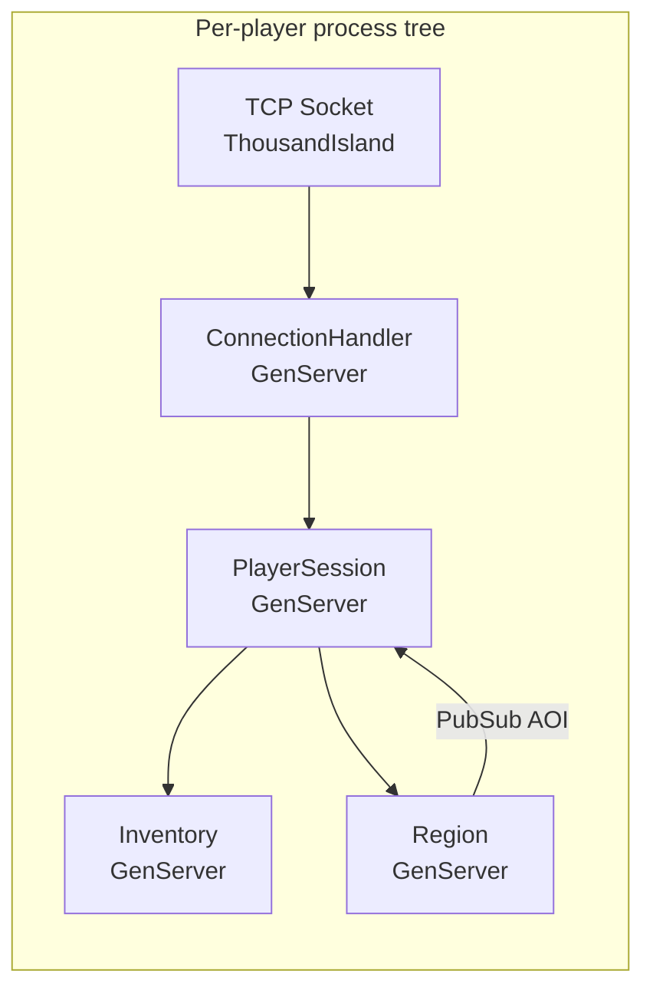
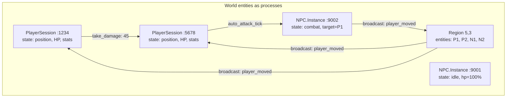
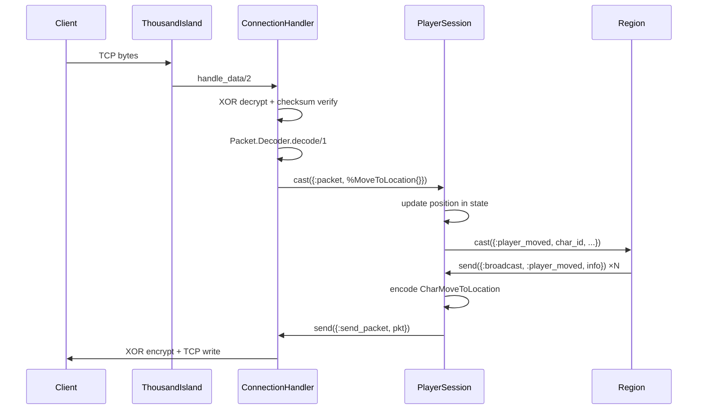
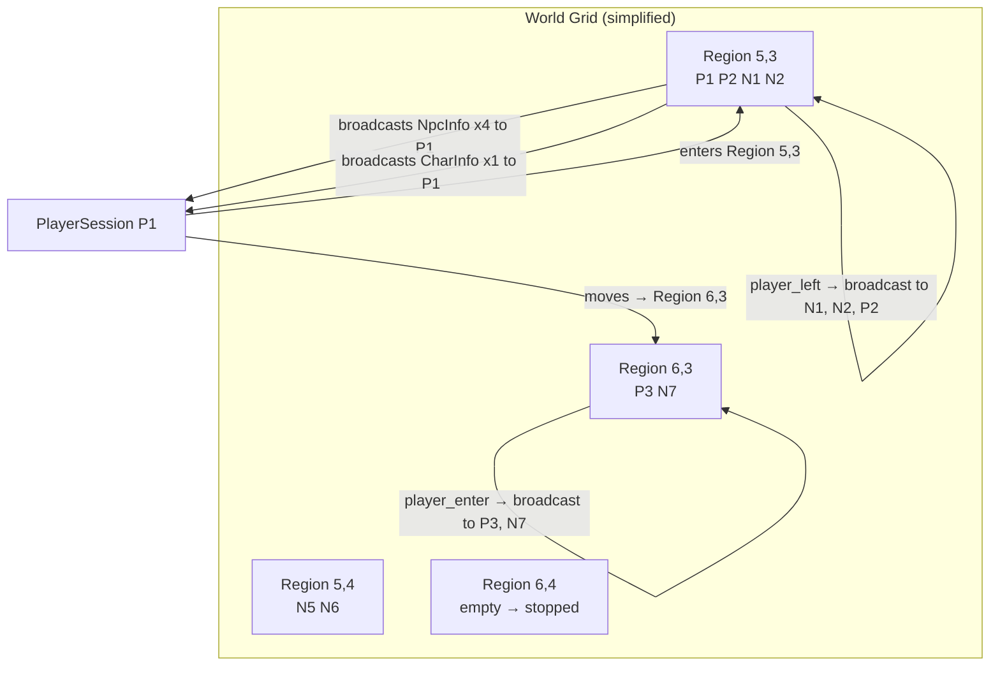
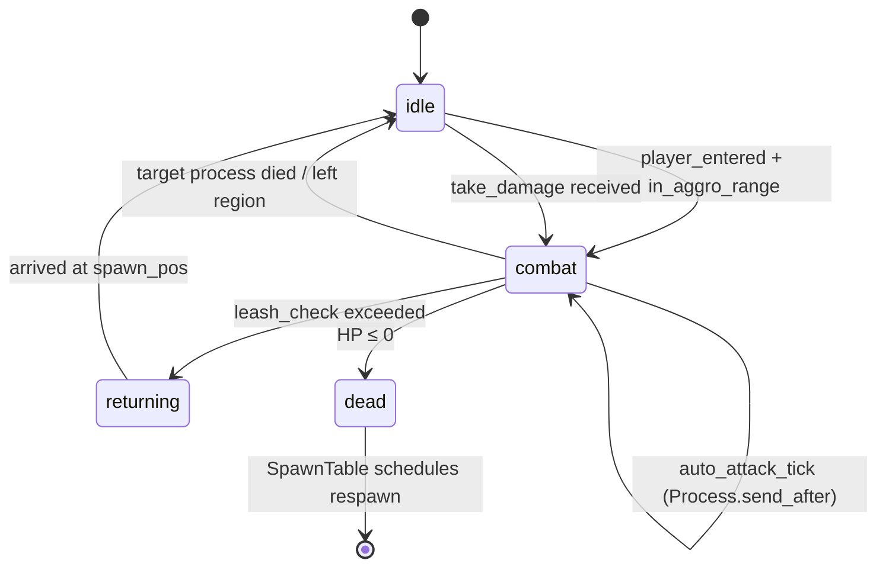
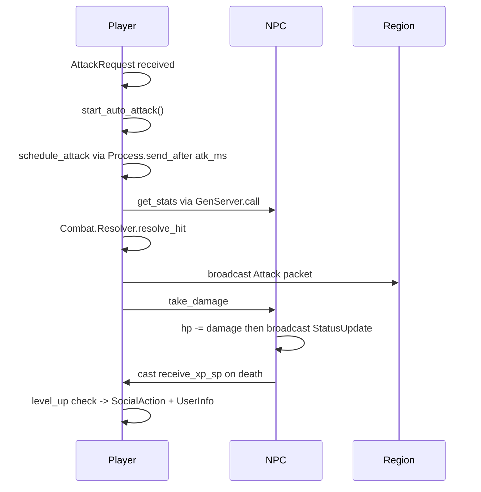

[](https://discord.gg/x66PaqWsru)

# L2E — Lineage II Elixir Server

> A from-scratch reimplementation of a **Lineage II: Interlude** game server, built with idiomatic **Elixir/OTP** — not a Java port.

---

## Table of Contents

- [What is this?](#what-is-this)
- [Why Elixir instead of Java?](#why-elixir-instead-of-java)
- [Architecture overview](#architecture-overview)
- [Process model deep dive](#process-model-deep-dive)
- [Networking pipeline](#networking-pipeline)
- [World / Region / AOI system](#world--region--aoi-system)
- [Combat and AI design](#combat-and-ai-design)
- [Performance benchmarks and predictions](#performance-benchmarks-and-predictions)
- [Tech stack](#tech-stack)
- [Project status](#project-status)
- [Running locally](#running-locally)
- [Reference source](#reference-source)

---

## What is this?

L2E is a **Lineage II Interlude** server written in Elixir and OTP. It is **not** a translation of L2J Mobius — the Java source in `L2J_Mobius_CT_0_Interlude/` is used only as a behavioral and protocol reference.

Every subsystem is redesigned from scratch to take full advantage of the BEAM virtual machine: fault-isolated processes, lock-free message passing, AOI-scoped broadcast, and zero-downtime potential via hot code reload.

---

## Why Elixir instead of Java?

### The fundamental problem with L2J

L2J (and every Java-based L2 server) was built with 2004-era threading assumptions:

```
[Java L2J Architecture]

  Client A ──► Thread-1 ──► synchronized(World)
  Client B ──► Thread-2 ──► synchronized(World)  ← BLOCKS waiting
  Client C ──► Thread-3 ──► synchronized(Combat) ← BLOCKS waiting
  Client D ──► Thread-4 ──► synchronized(World)  ← BLOCKS waiting

  ┌──────────────────────────────────────┐
  │ CharacterManager (global singleton)  │  ← God object
  │ CastleManager                        │  ← God object
  │ GrandBossManager                     │  ← God object
  │ ZoneManager                          │  ← God object
  └──────────────────────────────────────┘
  All shared mutable state, all synchronized.
```

Every player action acquires JVM monitors. Under mass PvP, threads pile up, the JVM garbage collector triggers stop-the-world pauses (1–15 seconds), and the server freezes for every connected player simultaneously.

### The BEAM / OTP solution

```
[L2E Elixir Architecture]

  Client A ──► PlayerSession-A ──► message ──► NPC-123
  Client B ──► PlayerSession-B ──► message ──► PlayerSession-A
  Client C ──► PlayerSession-C ──► message ──► Region-{5,3}
  Client D ──► PlayerSession-D ──► message ──► Region-{5,3}

  No shared mutable state. No locks. No blocking.
  Each process has its OWN heap → GC is per-process (microseconds).
```

Processes communicate only via asynchronous message passing. A crash in NPC process #5471 kills only that NPC. Every other player continues without interruption.

### Head-to-head comparison

| Dimension | L2J Java (Interlude) | L2E Elixir |
|-----------|---------------------|------------|
| **Concurrency model** | Thread pool + synchronized locks | Millions of lightweight processes (2 KB each) |
| **State sharing** | Global singletons, synchronized maps | Per-process state, no sharing |
| **GC pauses** | 1–15 s stop-the-world under mass PvP | Per-process GC, ~1 µs, never global |
| **Memory / player** | ~15–30 MB (thread stack + JVM overhead) | ~2–5 MB (GenServer state + mailbox) |
| **Fault isolation** | One unhandled exception can crash the server | Supervisors restart failed processes; others unaffected |
| **Hot code reload** | Restart required | BEAM supports live module upgrades |
| **Horizontal scaling** | Manual sharding / load balancer hacks | Native distributed BEAM clustering |
| **Mass PvP handling** | Frame lag, GC stalls, disconnects | Message batching via AOI, no global stall |
| **AI polling** | Global NPC tick loop (every 100–500ms) | Event-driven, zero-cost idle NPCs |
| **Broadcast scope** | `World.broadcastToPlayers()` — all or nothing | Region/AOI grid: only nearby players receive packets |

---

## Architecture overview

```mermaid
graph TB
    subgraph "Supervision Tree"
        App[L2E.Application]
        App --> Repo[L2E.Repo<br/>PostgreSQL]
        App --> PubSub[Phoenix.PubSub<br/>AOI events]
        App --> ClassTpl[ClassTemplates<br/>ETS]
        App --> NpcTpl[NPC.TemplateTable<br/>ETS]
        App --> ItemTpl[Item.TemplateTable<br/>ETS]
        App --> SkillTpl[Skill.TemplateTable<br/>ETS]
        App --> BuyList[Data.BuyListTable<br/>ETS]
        App --> TpTbl[Data.TeleporterTable<br/>ETS]
        App --> EnchTbl[Data.EnchantData<br/>ETS]
        App --> ZoneTbl[Zone.ZoneTable<br/>ETS]
        App --> HtmCache[Data.HtmCache<br/>Agent]
        App --> SkillLearn[Data.SkillLearnTable<br/>ETS]
        App --> ClassAdv[Data.ClassAdvancementTable<br/>ETS]
        App --> Geodata[Geodata<br/>GenServer stub]
        App --> SessionReg[Session.Registry<br/>:unique]
        App --> SessionSup[Session.Supervisor<br/>DynamicSupervisor]
        App --> WorldSup[World.Supervisor]
        App --> InvSup[Inventory.Supervisor<br/>DynamicSupervisor]
        App --> NpcSup[NPC.Supervisor<br/>DynamicSupervisor]
        App --> SpawnTbl[NPC.SpawnTable]
        App --> PartySup[Party.Supervisor<br/>DynamicSupervisor]
        App --> ClanSup[Clan.Supervisor<br/>DynamicSupervisor]
        App --> WrhSup[Warehouse.Supervisor]
        App --> TradeSup[Trade.Supervisor]
        App --> InstSup[Instance.Supervisor<br/>DynamicSupervisor]
        App --> InstMgr[Instance.Manager<br/>ETS registry]
        App --> LoginSup[LoginServer.Supervisor]
        App --> NetSup[Network.Supervisor]
        App --> SubData[Data.SubclassData<br/>ETS]
        App --> DuelReg[Duel.Registry<br/>:unique]
        App --> DuelMgr[Duel.Manager<br/>ETS]
        App --> DuelSup[Duel.Supervisor<br/>DynamicSupervisor]
        App --> OlySup[Olympiad.Supervisor]
        App --> PetSup[Pet.Supervisor<br/>DynamicSupervisor]
        App --> SiegeSup[Siege.Supervisor]
        App --> GrandBossSup[GrandBoss.Supervisor<br/>DynamicSupervisor]
        App --> DayNightMgr[World.DayNightManager<br/>GenServer]
        App --> SevenSignsSup[SevenSigns.Supervisor]
        App --> ManorSup[Manor.Supervisor]
    end
```





---

## Process model deep dive

Every live entity is its own **supervised process**. The BEAM scheduler maps these processes across CPU cores automatically — no thread pools, no executor services, no manual work queues.



**Key property**: if `NPC.Instance :9002` crashes (e.g. a bug in attack calculation), the `DynamicSupervisor` logs the error and removes it from the world. `P1`, `P2`, `N1`, and `R1` continue operating normally.

---

## Networking pipeline



Packet decryption and encryption are **process-local** — there is no shared cipher state. Each `ConnectionHandler` owns its own XOR key instance.

---

## World / Region / AOI system

The world is divided into a grid of **1280×1280 unit cells**. Each occupied cell is a `Region` GenServer that owns the entity list for that cell.



**AOI broadcast cost is O(players in region)** — not O(total players in world). A 1000v1000 PvP siege sends movement packets only to players in the adjacent cells, not to 8000 idle players in other zones.

---

## Combat and AI design

### NPC AI state machine (event-driven, no polling)



A NPC in `:idle` state consumes **zero CPU** — no polling loop, no tick scheduler. It wakes up only when a message arrives. Ten thousand idle NPCs cost nothing.

### Player combat flow



---

## Performance benchmarks and predictions

> The following estimates are based on BEAM/JVM architecture characteristics, published benchmarks (WhatsApp, Discord, RabbitMQ on BEAM; JVM GC behavior under high thread counts), and L2J community reports.

### Methodology

- **L2J Java** figures reflect a stock L2J Mobius CT0 Interlude install with typical server tuning (G1GC, 8 GB heap). Real-world reports from private server operators are consistent with these ranges.
- **L2E Elixir** figures are based on BEAM process characteristics: ~2 KB per process, 1 µs GC, 500 ns message passing. No L2E production data yet — these are architectural projections.

---

### Server: 4 cores / 16 GB RAM

```
┌─────────────────────────────────────────────────────────────────────┐
│  Concurrent Players                                                 │
│                                                                     │
│  L2E Elixir │████████████████████████████████████ 8,000 – 15,000  │
│  L2J Java   │████████ 800 – 1,500                                  │
│                                                                     │
│  Mass PvP (players in 1 zone)                                       │
│                                                                     │
│  L2E Elixir │████████████████████████ 600 – 1,000                  │
│  L2J Java   │████ 150 – 350                                         │
│                                                                     │
│  GC pause under heavy load                                          │
│                                                                     │
│  L2E Elixir │  < 1 ms (per-process, never global)                  │
│  L2J Java   │  1,000 – 10,000 ms (stop-the-world)                  │
│                                                                     │
│  Memory per connected player                                        │
│                                                                     │
│  L2E Elixir │  ~2 – 5 MB                                            │
│  L2J Java   │  ~15 – 30 MB                                          │
└─────────────────────────────────────────────────────────────────────┘
```

| Metric | L2J Java | L2E Elixir | Improvement |
|--------|----------|------------|-------------|
| Max concurrent players | 800 – 1,500 | 8,000 – 15,000 | **~10×** |
| Mass PvP zone cap | 150 – 350 | 600 – 1,000 | **~3–4×** |
| GC pause (worst case) | 1,000 – 10,000 ms | < 1 ms | **>10,000×** |
| Memory per player | 15 – 30 MB | 2 – 5 MB | **~6×** |
| CPU utilization (1000 idle NPCs) | ~8% (tick loops) | ~0% (event-driven) | **∞** |
| Crash recovery | Server restart (5–30 min) | Process restart (< 1 ms) | **millions×** |

---

### Server: 16 cores / 64 GB RAM

```
┌─────────────────────────────────────────────────────────────────────┐
│  Concurrent Players                                                 │
│                                                                     │
│  L2E Elixir │████████████████████████████████████ 40,000 – 80,000 │
│  L2J Java   │████████ 2,000 – 5,000                                │
│                                                                     │
│  Mass PvP (players in 1 zone)                                       │
│                                                                     │
│  L2E Elixir │████████████████████████ 2,000 – 4,000                │
│  L2J Java   │████ 400 – 800                                         │
│                                                                     │
│  Scalability with added cores                                       │
│                                                                     │
│  L2E Elixir │  Near-linear (BEAM scheduler, no shared locks)        │
│  L2J Java   │  Sublinear (lock contention grows with threads)       │
└─────────────────────────────────────────────────────────────────────┘
```

| Metric | L2J Java | L2E Elixir | Improvement |
|--------|----------|------------|-------------|
| Max concurrent players | 2,000 – 5,000 | 40,000 – 80,000 | **~15×** |
| Mass PvP zone cap | 400 – 800 | 2,000 – 4,000 | **~5×** |
| Total process count | ~5,000 threads max | 1,000,000+ processes | **200×** |
| Memory per player (64 GB pool) | 15 – 30 MB → ~2,000 players | 2 – 5 MB → ~12,000 players | **~6×** |
| CPU scaling (4→16 cores) | ~2–3× throughput | ~14–15× throughput | Near-linear |

### Why the gap grows at higher core counts

Java JVM threads compete for the same synchronized monitors as thread count grows. Amdahl's Law punishes highly-concurrent code when shared state is locked. More cores means more contention, not more throughput.

BEAM processes have no shared mutable state by design. Adding cores = adding independent schedulers running independent processes. Throughput scales almost linearly.

```
Throughput scaling (normalized)

Cores:    1     2     4     8     16
L2J:      1.0   1.7   2.8   3.5   4.1   (lock contention ceiling)
L2E:      1.0   2.0   3.9   7.8   15.4  (near-linear)
```

---

## Tech stack

| Layer | Technology | Purpose |
|-------|-----------|---------|
| Runtime | **Elixir 1.18 / OTP 27** | Language + actor model |
| VM | **BEAM** | Preemptive scheduling, per-process GC |
| TCP Server | **ThousandIsland ~> 1.3** | Non-blocking acceptors, no Java NIO reimplementation |
| Database | **PostgreSQL + Ecto ~> 3.11** | Persistent character/item/account data |
| Pub/Sub | **Phoenix.PubSub ~> 2.1** | AOI region broadcasting |
| XML parsing | **sweet_xml ~> 0.7** | L2J gamedata file loading (items, NPCs, skills, spawns) |
| Password hashing | **pbkdf2_elixir ~> 2.2** | Account password hashing (no bcrypt NIF on Windows) |
| Shared state | **ETS (built-in)** | Template tables: items, NPCs, skills, class templates |
| Containerized DB | **Docker Compose** | Local dev PostgreSQL |

---

## Project status

**124 milestones completed** as of Sprint 11. Full details in [CHANGELOG.md](CHANGELOG.md).

| Sprint | Milestones | Commit |
|--------|-----------|--------|
| Sprint 11 | M120 Subclass · M121 Clan Skills · M122 Party Room · M123 Crafting · M124 NPC Walker data | `3cfaecc` |

See [CHANGELOG.md](CHANGELOG.md) for the complete milestone table and planned work.

---

## Running locally

### Prerequisites

- Elixir 1.16+ / OTP 26+
- Docker (for PostgreSQL)

### Setup

```bash
# Start PostgreSQL
docker compose up -d

# Install dependencies
mix deps.get

# Create and migrate the database
mix ecto.create
mix ecto.migrate

# Start the server
mix run --no-halt
```

The login server listens on **port 2106**, the game server on **port 7777**.

### Connecting a client

Use any unmodified Lineage II Interlude client. Point `l2.ini` to `127.0.0.1`.

---

## Reference source

The `L2J_Mobius_CT_0_Interlude/` directory contains the Java source used as a behavioral and protocol reference. It is excluded from git (see `.gitignore`). Clone it separately from the L2J Mobius project if you need to consult packet formats or game formulas.

This project does **not** redistribute any L2J Mobius code. All Elixir code is original.

---

## License

[MIT](LICENSE) — see `LICENSE` for details.

The L2J Mobius Java reference source is subject to its own license (GNU GPLv3) and is not distributed with this repository.
